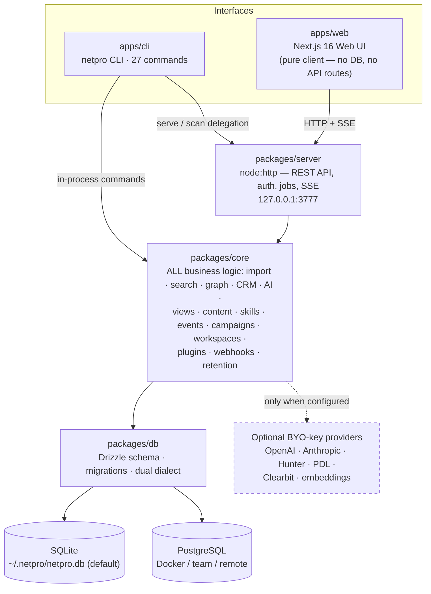

# NetPro

**Your professional network, owned by you.**

NetPro is a **local-first relationship intelligence platform** for your professional
network. Import your LinkedIn connections export and NetPro turns it into a private,
queryable network graph that lives on your own machine — with hybrid search, community
detection, warm-introduction pathfinding, relationship-health scoring, and outreach
drafting that a human reviews and sends.

Most tools that claim to manage your professional relationships are either a social
platform that owns your data and rents the intelligence back to you, or a sales CRM
shaped like a pipeline. NetPro is neither. It is an open-source **personal CRM and
network-graph analyzer** that runs entirely on your hardware (SQLite by default,
PostgreSQL if you want a server), never phones home, and treats every AI or enrichment
provider as an optional, bring-your-own-key enhancement. The product loop is simple:
**Import → Understand → Discover → Maintain → Act.**

[](LICENSE)
[](https://github.com/NiravRVaghasiya/NetPro/releases/latest)
[](package.json)
[](https://github.com/NiravRVaghasiya/NetPro/actions/workflows/ci.yml)

**[Quick Start](#quick-start)** · **[Documentation](#documentation)** · **[Releases](https://github.com/NiravRVaghasiya/NetPro/releases/latest)** · **[CLI & API](#cli--api)** · **[License](#license)**

<!-- TODO: Add Observatory screenshot (network size, communities, jobs, live activity) -->
<!-- TODO: Add Network graph screenshot (force-directed graph with communities, hubs, bridges) -->
<!-- TODO: Add Pathfinder screenshot (ranked warm-intro chains as a hop-by-hop stepper) -->
<!-- TODO: Add Search screenshot (hybrid search with filters, facets, "why this matched") -->
<!-- TODO: Add Person view screenshot (contact timeline: profile, stats, interactions, follow-ups) -->
<!-- TODO: Add Import screenshot (upload → preview/validate → import with live job progress) -->

---

## Why NetPro?

Your professional network is one of the most valuable assets you own — and almost all
of it lives inside platforms that treat it as *their* asset. The graph of who you know,
who bridges which communities, and who could introduce you to whom is exactly the
intelligence those platforms monetize behind premium subscriptions. Generic CRMs solve a
different problem: they track deals, not relationships, and they live in someone else's
cloud.

NetPro's position is that **network intelligence should belong to the person who earned
the network**:

- **Your network belongs to you.** One SQLite file in `~/.netpro` (or your own
  PostgreSQL), CSV import from LinkedIn, CSV export anytime, `netpro backup` /
  `netpro restore`. No cloud account, no lock-in, no hosted platform anywhere in the
  stack.
- **Local-first, private by design.** The server binds `127.0.0.1:3777` by default.
  Exposing it further is an explicit, warned-about choice. No telemetry, no third-party
  scripts, no cookies.
- **Human-controlled outreach.** NetPro drafts; a human sends. There is no SMTP, no
  stored mailbox credentials, no background sending — campaigns produce messages you
  review, send from your own mail client, and record back.
- **Explainable relationship intelligence.** Search results say *why* they matched
  (`--explain`), relationship scores have a documented formula, inferred edges arrive
  as *pending* until you confirm them, and skill extraction can only pick from a
  bounded, inspectable taxonomy.
- **Everything optional except the app.** AI drafting (OpenAI/Anthropic), enrichment
  (Hunter/PDL/Clearbit) and semantic search (embedding providers) are BYO-key
  enhancements. With none configured, NetPro still imports, indexes, searches,
  analyzes, scores and reminds.
- **Open source and extensible.** MIT-licensed, with a plugin system (capability and
  network allow-lists, checksummed self-hosted marketplace), outbound webhooks, and
  one core library shared by the CLI, HTTP API and web UI.

|  | **NetPro** | Traditional professional network | Generic CRM |
| --- | --- | --- | --- |
| Data ownership | Your machine, your database, CSV in/out | Platform-owned; export limited to connections CSV | Vendor cloud |
| Local-first | Yes — runs offline on SQLite | No | No |
| Network graph intelligence | Communities, centrality, components, diversity | Hidden behind premium tiers | Not the model (deals/pipelines are) |
| Warm introduction discovery | Ranked paths with the first ask drafted | 2nd-degree list, no ranking by relationship strength | No |
| Relationship intelligence | Explainable score, dormancy, follow-ups | None you control | Activity tracking for sales |
| Human-controlled outreach | Drafts only — you send | In-platform messaging | Automated sending is the point |
| Open source | MIT | No | Rarely |

---

## What can NetPro do?

### Understand — see your network as a graph

- **Network visualization** — a force-directed graph of your contacts and
  relationships, colored by community, in the web UI.
- **Communities** — discover naturally occurring clusters in your professional graph
  (Louvain community detection).
- **Hubs and bridges** — find the best-connected people, and the people who connect
  otherwise separate parts of your network (degree and Brandes betweenness centrality).
- **Relationship strength** — every relationship carries a score (recency 40% /
  frequency 25% / depth 20% / richness 15%), so you can see which ties are strong,
  weak, or going cold.
- **Network analytics** — a health score, 12-month growth (using the real
  `Connected On` dates), industry/company diversity, company clusters, connected
  components, and a dormant-ties reconnect list.

### Find — search and discovery that explain themselves

- **Hybrid search** — three arms fused with reciprocal rank fusion: portable substring,
  keyword full-text (SQLite FTS5 / Postgres `tsvector` over the whole contact document —
  notes, tags, industry, seniority, country), and optional semantic search via your own
  embedding key. `--explain` tells you *why* each result matched.
- **Facets and filters** — company, role, location, industry, seniority, relationship
  score, activity window, tags, skills, community.
- **Warm introduction paths** — the [killer workflow](#the-killer-workflow-find-a-warm-introduction):
  ranked introduction chains to anyone in your graph, with the first ask included.
- **Event attendee matching** — import a conference attendee CSV and find who is
  already in your network, matched in explainable tiers (exact email / exact name /
  last-name-plus-initial — the fuzzy tier is reported, never auto-linked).

### Maintain — keep important relationships alive

- **Interaction history** — a per-contact timeline of emails, meetings, calls, notes,
  LinkedIn messages and introductions.
- **Follow-up reminders** — due / overdue / upcoming views, completion, snooze,
  cancel, optional recurrence, assignment to a teammate.
- **Relationship health** — scores recompute on every logged interaction; dormancy
  analysis surfaces who has gone quiet before the relationship dies.
- **Edge provenance** — inferred relationships (CSV mutuals, event attendance) carry
  `source`, `confidence` and `status`, and stay *pending* — excluded from analysis
  until you confirm them.

### Act — outreach on your terms

- **AI outreach drafting** — BYO-key (OpenAI-compatible or Anthropic) message drafts
  with tone, context and ask. NetPro drafts; you send.
- **Campaigns** — multi-step drip sequences with whitelisted merge variables
  (`{{firstName}}`, `{{company}}`, …), recipient lists from a saved search, a per-day
  send limit, and a lifecycle (draft → active → paused/completed/archived). Confirmed
  sends log real interactions; a recorded reply cancels the remaining drip.
- **Event recommendations** — `netpro events recommend` tells you which conference to
  attend next based on attendee overlap with your network, with a stated reason.
- **Skills gap analysis** — compare a target role or job description against one
  contact or your whole network using a bounded, explainable 101-skill taxonomy:
  present / partial / missing, with the field and snippet behind every hit.
- **Content tracking** — follow what you and your network publish (CSV/RSS import,
  engagement snapshots, mentions); **profile cards** — a portable HTML card or vCard
  with privacy-hardened view analytics.

### Extend — a platform, not just an app

- **CLI** — 27 commands; everything supports `--help`, most support `--json`.
- **HTTP API + SSE** — a JSON API over `node:http` with a job registry and live event
  streams; the web UI is a pure client of it.
- **Plugins** — strict manifests (semver, engine ranges, capability allow-list,
  exact-host network allow-list), ESM loader, per-workspace registry of enrichers, AI
  providers, content providers and commands. Plugins install **disabled** and require
  an explicit permissions review.
- **Webhooks** — 18 outbound events, HMAC-SHA256 signed, SSRF-guarded, retried with
  exponential backoff, with a delivery log and redelivery.
- **Workspaces & roles** — owner / admin / member / viewer, invite links, authorship
  stamps, an audit log, and an encrypted key vault (AES-256-GCM) for provider
  credentials.

---

## The killer workflow: find a warm introduction

You want to reach someone you don't know. Cold outreach converts badly; a warm
introduction from a mutual contact converts well — but finding the *right* chain by
hand means scrolling 2nd-degree lists and guessing who actually knows whom well.

```text
You ──(strong, spoke 3 weeks ago)──▶ Sarah ──(met at NeurIPS, 4 months ago)──▶ Mark ──▶ Target
```

NetPro walks your graph, finds every realistic chain to the target, and ranks them by
relationship strength — a chain is only as good as its weakest tie (score = 0.6 ×
weakest tie + 0.4 × mean hop strength), with each hop's recency shown so a
"strong" relationship from 2019 doesn't fool you:

```bash
netpro path "Ada Lovelace"
```

```text
Path 1 (strength 0.78)
  you → Sarah Chen      score 0.82 · last contact 21 days ago
  Sarah Chen → Ada L.   score 0.74 · last contact 120 days ago

  First ask: "Hi Sarah — you know Ada Lovelace from …; would you be open to
  making an introduction? I'd like to talk to her about …"
```

Add `--draft` and NetPro's AI composer (your key, your provider) writes the actual
introduction request to your first hop. The web UI's **Pathfinder** page shows the
same ranked chains as a hop-by-hop stepper; the **Network** page overlays them on the
graph. You decide who to ask — NetPro just makes sure you ask the person with the
strongest, most recent tie.

---

## Observatory: network intelligence, in plain language

The **Observatory** (web) and `netpro analyze` (CLI) turn a contact database into
answers. Every metric is computed locally, over your own data:

| The question | What NetPro shows | Under the hood |
| --- | --- | --- |
| "How healthy is my network?" | A single network health score, activity/dormancy breakdown | Composite of size, engagement, diversity |
| "Who connects separate parts of my network?" | The bridges — people whose removal would split communities | Brandes betweenness centrality |
| "Who are my hubs?" | The best-connected people per community and overall | Degree centrality |
| "What communities do I actually belong to?" | Naturally occurring clusters, labeled and filterable in search | Louvain community detection |
| "Is my network an echo chamber?" | Industry and company diversity, company clusters | Shannon entropy |
| "Who have I lost touch with?" | Dormant ties ranked for reconnection | Recency + relationship score |
| "How did my network grow?" | 12-month growth using when relationships actually formed | LinkedIn `Connected On` dates |
| "How tightly woven is it?" | Connected components, average path length | Graph traversal |

---

## Privacy & ownership

Privacy in NetPro is an architecture property, not a promise:

- **Local by default.** `netpro serve` binds `127.0.0.1:3777`. Binding to `0.0.0.0`
  requires an explicit setting, prints a warning naming what just became reachable,
  and ensures a remote access token exists. Three auth modes (`local` / `token` /
  `open`) — no OAuth, no cookies, no third-party sign-in anywhere.
- **Your data, your files.** Everything lives in one directory (`~/.netpro`):
  config, SQLite database (WAL mode), logs, keys. Export to CSV at any time;
  `netpro backup` / `netpro restore` snapshot SQLite or `pg_dump` PostgreSQL.
- **What leaves your machine — only what you choose.** With no keys configured,
  nothing does: import, search, analytics, graph, scoring and reminders are fully
  offline. Provider calls (OpenAI/Anthropic for drafts, Hunter/PDL/Clearbit for
  enrichment, embedding providers for semantic search) happen only when you
  configure a key *and* run the command — never in the background during import.
- **Secrets never surface.** Provider keys live in the environment or the encrypted
  CLI keychain; the workspace key vault encrypts at rest with AES-256-GCM and
  returns masked values only; webhook secrets are shown exactly once on rotation.
- **Human-controlled outreach.** No SMTP, no stored mailbox credentials, no
  background sending. NetPro drafts; you send from your own mail client and record
  the result.
- **Viewer privacy by construction.** Profile-card view analytics store daily-salted
  HMAC-SHA256 viewer digests — never raw IPs — filter bots with a vendored deny-list,
  and purge raw rows after 90 days.
- **No telemetry, no third-party scripts, no cookies** in the app or the observer
  features.
- **Egress guards.** Webhook deliveries refuse private-network targets (loopback,
  RFC 1918, cloud-metadata addresses) at creation and re-check every redirect hop;
  plugins may only reach hosts their manifest declares.
- **Retention.** A daily job (at most one run per 24 h, audited) purges raw profile
  views after 90 days, webhook deliveries after 30, and old content snapshots after
  365 — the latest snapshot per item always survives.

See the [remote-exposure checklist](docs/deployment.md) before putting NetPro on a
server.

---

## Quick start

**Prerequisites:** Node.js ≥ 20. No Docker, no database server, no account.

### Quickest local setup

```bash
# Install the CLI from the release bundle
npm install -g https://github.com/NiravRVaghasiya/NetPro/releases/download/v3.0.1/netpro-3.0.1.tgz

netpro init       # creates ~/.netpro: config.toml, SQLite db, logs, keys
netpro serve      # runs the API + built-in console at http://127.0.0.1:3777
netpro status     # install · database · identity · server health · providers
```

> The unscoped npm name `netpro` belongs to an unrelated package, so NetPro is
> distributed as the checksummed tarball attached to each
> [release](https://github.com/NiravRVaghasiya/NetPro/releases/latest) rather than
> from the npm registry. See [`docs/releasing.md`](docs/releasing.md).
>
> `netpro` "not recognized" right after a successful install is a `PATH`
> question, not an install failure — npm's global prefix has to be on `PATH`.
> [When `netpro` is not
> recognized](docs/getting-started.md#when-netpro-is-not-recognized-after-installing)
> covers that, plus the bare `npm install -g` that silently installs the current
> directory.

Then, from another terminal — the first five minutes that matter:

```bash
netpro import ~/Downloads/Connections.csv   # your LinkedIn export (--preview validates first)
netpro scan                                 # reindex + enrich + graph in one observable sweep
netpro search "AI founders" --explain       # hybrid search that says why each hit matched
netpro analyze                              # health score, growth, clusters, dormant ties
netpro path "Ada Lovelace" --draft          # ranked warm-intro chains + the first ask
```

### From a source checkout

```bash
git clone https://github.com/NiravRVaghasiya/NetPro.git
cd NetPro
npm install
npm run build

node apps/cli/dist/index.js init
node apps/cli/dist/index.js serve       # http://127.0.0.1:3777
```

Run the web UI (Next.js) against the running server:

```bash
cp apps/web/.env.example apps/web/.env.local   # defaults to http://127.0.0.1:3777
npm run dev -w apps/web                        # http://localhost:3000
```

The web UI is a **pure client**: it opens no database and serves no API of its own.
If the server isn't running, every page says so instead of failing. First run
onboarding is two pastes: **People → + Add Person** accepts a LinkedIn profile
URL (`https://www.linkedin.com/in/username`), validates it, and adds the person
— or points at the existing contact instead of duplicating; **Settings →
Connect an API** stores a provider key encrypted on the server after verifying
it where the provider allows a safe check.

### Docker (PostgreSQL, self-hosted)

One image, three roles (API server, web UI, CLI for the migration job):

```bash
cp .env.example .env          # set POSTGRES_PASSWORD (and auth mode)
docker compose up -d          # migrate → server (:3777) → web (:3000)
curl http://127.0.0.1:3777/api/health
```

Postgres is not published to the host by default and app ports bind to loopback
unless you change them. For any Node host with your own PostgreSQL
(`DB_DIALECT=postgresql`, `DATABASE_URL=…`), migrations, TLS, pooling and health
semantics, see [`docs/deployment.md`](docs/deployment.md).

---

## Architecture



The dependency rule is one-way and enforced in CI:

```text
packages/db  →  packages/core  →  packages/server  →  apps/web
                                 ↘  apps/cli
```

**One operation → one job → one event stream → many interfaces.** `@netpro/core`
holds every business rule; the server orchestrates it behind HTTP, auth, jobs and
SSE; the web UI only renders what the server returns. A scan started as
`netpro scan` in a terminal and a scan started from the web UI are the same
`runScan()` implementation, the same `Job`, and the same SSE progress events —
nothing is reimplemented in a UI layer. Long-running work reports through a job
registry (`queued → running → completed/failed/cancelled`, 0–100 progress) that the
CLI, the API and the Activity page all consume.

---

## Technical stack

| Layer | Technology |
| --- | --- |
| Language | TypeScript (ESM), Node.js ≥ 20 |
| Frontend | Next.js 16 (App Router, standalone output), Tailwind CSS |
| Backend | `node:http` — no framework; commander CLI; tsup bundle |
| Database | SQLite (better-sqlite3, WAL, FTS5) or PostgreSQL 16 — Drizzle ORM, 27 tables, 15 mirrored migrations per dialect |
| Testing | Vitest (144 test files, hermetic real-SQLite suites), PostgreSQL integration suites, performance-budget tests, shell smoke tests |
| Build / tooling | npm workspaces + Turborepo, ESLint, Prettier, GitHub Actions (CI + releases), Docker multi-role image |

---

## Key technical capabilities

For the engineering detail behind the product sections:

- **Graph engine** — Louvain community detection, degree + Brandes betweenness
  centrality, connected components, average path length, BFS pathfinding ranked by
  relationship strength (0.6 × weakest tie + 0.4 × mean hop strength).
- **Hybrid search** — substring + FTS5/`tsvector` full-text + optional embedding arm,
  fused with reciprocal rank fusion (k = 60); embeddings stored as portable JSON —
  no `pgvector` requirement; graceful degradation (no index → substring, no key →
  no semantic arm, provider down → keyword results with a stated reason).
- **Explainability & provenance** — `matchReasons` per search hit, `source` /
  `confidence` / `status` per graph edge, field-and-snippet evidence per skill hit,
  tiered event-match scores.
- **Jobs & SSE** — a typed job registry and event stream (`job.*`, `scan.*`,
  `import.*`, `relationship.discovered`) consumed identically by CLI, API and UI.
- **Auth & hardening** — loopback-trust / bearer-token / open auth modes; request
  ids, security headers, CORS origin allow-list, per-IP rate limiting (429 +
  `Retry-After`), bounded request bodies, JSON-only errors.
- **Crypto** — AES-256-GCM key vault with principal/slot-bound key derivation,
  encrypted CLI keychain, 0600 token files, HMAC-SHA256 webhook signatures
  (`t=<unix>,v1=<hmac>`, 5-minute tolerance), daily-salted HMAC viewer digests.
- **SSRF defense** — webhook targets and plugin `fetch` calls are checked against
  private-network ranges and manifest host allow-lists, re-validated on every
  redirect hop (≤ 3, 10 s timeout).
- **Plugin platform** — ESM loader, per-workspace registry, crash isolation (a
  failing plugin is disabled, not fatal), checksummed self-hosted marketplace with
  hardened tarball extraction (rejects symlinks, absolute paths, `..` escapes).
- **Dual-dialect data layer** — one Drizzle schema pair, additive idempotent
  migrations, Postgres advisory-lock-serialized cold starts, `netpro migrate
  --status`, backup/restore on both dialects.

---

## CLI & API

The CLI is the primary interface — 27 commands, every one with `--help`, most with
`--json` for scripting, and a global `--workspace <id>` scope. Highlights:

| Command | What it does |
| --- | --- |
| `netpro init` / `serve` / `status` | Create the local install, run server + console, show health |
| `netpro import [file]` | LinkedIn CSV import (`--preview` validates without writing) |
| `netpro scan` | One observable sweep: reindex + enrichment + graph analysis |
| `netpro search [query]` | Faceted hybrid search (`--explain`, `--skills`, `--community`, …) |
| `netpro analyze` | Health score, growth, diversity, clusters, dormant ties, graph, views |
| `netpro path <target>` | Ranked warm-intro chains and the first ask (`--draft` composes it) |
| `netpro track` | CRM interactions and follow-ups (log / add / done / snooze / assign) |
| `netpro outreach` / `campaign` | AI-drafted messages and batch drip campaigns — never sent |
| `netpro edge` | Graph edge provenance: add, import, merge, confirm, reject |
| `netpro skills` / `events` / `content` | Skills gap analysis, event matching, content tracking |
| `netpro card` / `export` / `backup` / `restore` | Profile cards (HTML/vCard), CSV export, database backups |
| `netpro team` / `plugin` / `webhook` / `config` / `token` / `migrate` | Workspaces, plugins, outbound webhooks, encrypted config, auth token, migrations |

A concrete session:

```bash
netpro init && netpro import ~/Downloads/Connections.csv && netpro scan

netpro search "founder" --industry "software" --active-within 180 --explain
netpro analyze --graph --limit 5
netpro path "Ada Lovelace" --draft

netpro track log ada@example.com --type email --direction outbound --note "Sent the deck"
netpro track add ada@example.com --met-at "NeurIPS 2026" --follow-up 2w
netpro track list --overdue
```

**HTTP API.** `netpro serve` exposes a JSON API (REST + SSE) over `node:http`;
`/api/health` and `/api/server-info` are public, everything else requires the local
operator (loopback in `local` mode, bearer token otherwise). Representative routes:
`GET /api/search`, `GET /api/analytics`, `GET /api/graph/path?target=…`,
`GET /api/contacts/:id`, `POST /api/contacts` (add a person from a LinkedIn URL),
`POST /api/import`, `POST /api/scan`, `GET /api/jobs`, SSE `GET /api/events`,
`GET /api/credentials` + `PUT /api/credentials/:provider` (encrypted API-key
storage, masked reads). The full route table, job model and SSE contract live in
[`packages/server/README.md`](packages/server/README.md).

**Web UI.** Eleven pages backed entirely by that API: landing, **Observatory**,
**Network** graph, **Search**, **Pathfinder**, **People** (CRM list + contact
timeline, with **+ Add Person** from a LinkedIn URL), **Activity** (live SSE
feed), **Scan**, **Import** (CSV flow plus single-profile add), **Settings**
(provider status plus **Connect an API** for BYO keys). Deeper
capabilities (campaigns, skills, events, content, teams, plugins, webhooks) are
CLI-first by design.

---

## Testing

```bash
npm test             # hermetic vitest suites — real scratch SQLite files, not mocked SQL
npm run test:pg      # PostgreSQL integration suites (needs NETPRO_TEST_DATABASE_URL)
npm run smoke        # CLI + installed-package + server + web-UI smokes against shipped artifacts
npm run lint && npm run typecheck
```

- **144 test files** across CLI, core, db, server and web workspaces.
- **Performance budgets ship as tests** — graph analytics at 3,000 nodes / 8,000
  edges, skills extraction at 5,000 contacts, search and view/content pipelines.
- **CI proves the published shape, not just compilation** — lint/typecheck on Node
  20 + 22 → unit → SQLite integration + marketplace e2e → PostgreSQL integration +
  performance pass → build + package checks → CLI/server/web smokes → Docker e2e
  against real Postgres. Migrations must apply twice as a no-op; `token` mode must
  answer 401 without the token and 200 with it.

---

## Security

The security model is described in full in [Privacy & ownership](#privacy--ownership)
and [`docs/deployment.md`](docs/deployment.md). Summary: loopback-only by default
with three explicit auth modes; encrypted key storage (AES-256-GCM vault, CLI
keychain, 0600 token files); signed webhooks with SSRF guards on every delivery and
redirect; sandbox-free but allow-list-gated plugins that install disabled behind a
permissions review; checksummed marketplace tarballs with hardened extraction; rate
limiting, security headers and origin allow-listing on every response.

There is no formal security policy file yet — if you find a vulnerability, please
report it responsibly via
[GitHub issues](https://github.com/NiravRVaghasiya/NetPro/issues) or by contacting
the maintainer directly, rather than demonstrating it publicly. Never commit
secrets: provider keys belong in the environment, the CLI keychain
(`netpro config set`), or the workspace key vault.

---

## Project status

**v3.0.1 — "The Platform"** (2026-09-11) is the current
[release](https://github.com/NiravRVaghasiya/NetPro/releases/tag/v3.0.1): the
first tagged cut of the platform, re-issued as a patch because the v3.0.0 asset
installed but could not run `netpro init` (what happened, and what the gate now
proves instead: [v3.0.1 notes](docs/releases/v3.0.1.md)). The platform was built
in public through a phased roadmap (v1.0 import/search/analytics/AI drafts → v1.5
CRM and campaigns → v2.0 graph engine, pathfinder, hybrid search, skills, events →
v2.5 privacy-first profile views and content tracking → v3.0 workspaces, key vault,
plugins, marketplace, webhooks, retention).

**Stable today:** import/export, dual-dialect storage and migrations, hybrid search,
graph analytics and pathfinding, CRM scoring and follow-ups, campaigns and outreach
drafting, skills/events/content modules, workspaces and roles, the local server with
jobs/SSE, the web UI, Docker/PostgreSQL deployment, backup/restore.

**Experimental / limited by design:**

- Plugins run in-process — the manifest allow-list and review gate are the
  containment, not a sandbox.
- The marketplace is a self-hosted static index (`marketplace/index.json`), not a
  curated store.
- Event-discovery providers ship as disabled stubs (`devto` / `twitter` / `github`
  content providers likewise); the interface exists, live providers don't yet.
- Embeddings are portable JSON — no native `pgvector` ANN index yet.

### Roadmap

Deliberately deferred, documented not forgotten: live event-discovery providers ·
`pgvector` ANN indexing · AI skills extraction as a default (opt-in today) ·
`$EDITOR` draft review · a background webhook delivery worker and inbound webhooks ·
web pages for the CLI-only capabilities · npm-registry publishing (blocked by the
taken unscoped name; releases ship tarballs instead). Real SMTP sending is a
non-goal — NetPro drafts, a human sends.

---

## Contributing

```bash
npm install          # Node ≥ 20; npm workspaces + Turborepo
npm run dev          # workspace dev scripts
npm run build        # build every workspace
npm run lint         # ESLint across the monorepo
npm run typecheck    # tsc --noEmit everywhere
npm test             # hermetic vitest suites
npm run format       # Prettier
```

Workflow: fork → branch → keep the one-way dependency rule
(`db → core → server → apps`) → add tests next to the code (`*.test.ts` beside the
module, real SQLite scratch files rather than mocked SQL) → open a PR against
`master`. CI is the gate: lint, typecheck, unit + integration tests on both
dialects, package checks, smokes and a Docker e2e must all pass. Business logic
belongs in `packages/core` — never in a UI layer.

Issues and feature requests are welcome via
[GitHub issues](https://github.com/NiravRVaghasiya/NetPro/issues).

---

## Documentation

| Document | Covers |
| --- | --- |
| [`docs/getting-started.md`](docs/getting-started.md) | Install, first import, auth modes, running the CLI |
| [`docs/local-first.md`](docs/local-first.md) | The `~/.netpro` install, identity, `serve`, configuration reference |
| [`docs/deployment.md`](docs/deployment.md) | Postgres, Docker, migrations, TLS, health checks, remote-exposure checklist |
| [`docs/webhooks.md`](docs/webhooks.md) | Event catalog, signature verification, receiver recipes (Zapier, n8n, Make, Node) |
| [`docs/releasing.md`](docs/releasing.md) | Cutting a release: the tag gate and the installable CLI bundle |
| [`docs/releases/`](docs/releases) | Notes published with each release |
| [`packages/server/README.md`](packages/server/README.md) | The HTTP API contract, job model and SSE transport |

---

## License

[MIT](LICENSE) © NetPro Contributors
